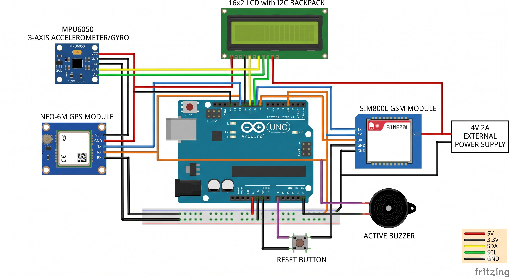
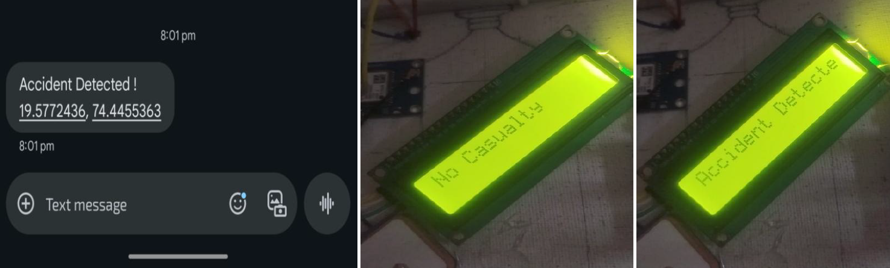

# 🚗 Vehicle Accident Detection & Emergency Alert System

<div align="center">


> ⚡ A standalone embedded system that detects real vehicle accidents and automatically sends GPS location via SMS to two emergency contacts — within seconds.

</div>

---

## 📟 Serial Monitor Preview

```bash
---- Accident Detection System @ 9600 baud ----

[INIT]   >> Booting system...
[OK]     >> MPU6050 IMU initialized
[OK]     >> NEO-6M GPS module ready
[OK]     >> SIM800L GSM module connected
[OK]     >> LCD display initialized
[READY]  >> System monitoring... Threshold: 25 m/s²

[DATA]   >> Accel X:  1.2 m/s² | Y:  0.5 m/s²  → Normal driving
[DATA]   >> Accel X:  8.3 m/s² | Y:  3.1 m/s²  → Hard brake (ignored)
[DATA]   >> Accel X:  9.6 m/s² | Y:  2.4 m/s²  → Speed bump (ignored)
[ALERT]  >> Impact detected! X: 27.4 m/s²
[WARN]   >> Threshold exceeded — Accident confirmed!
[INFO]   >> Fetching GPS coordinates...
[OK]     >> Location: Lat:00.00000, Lon:00.00000
[OK]     >> Sending SMS to contact 1...
[SENT]   >> Alert delivered ✅
[OK]     >> Sending SMS to contact 2...
[SENT]   >> Alert delivered ✅
[INFO]   >> Cancellation window: 10 sec (press button if no casualty)
[DONE]   >> No button press — resuming monitoring...
```

---

## 📌 Overview

This system is a **real-time accident detection and emergency alert device** built on Arduino Uno. It continuously monitors vehicle motion using the MPU6050 accelerometer. When a real accident-level impact is detected, it:

1. Confirms the impact exceeds **25 m/s² (~2.5g)** on X or Y axis
2. Fetches the latest GPS coordinates cached in background via NEO-6M
3. Sends an **SMS with live location** to **two emergency contacts** via SIM800L GSM
4. Shows status on a **16x2 LCD display**
5. Sounds a **buzzer alert**
6. Waits **10 seconds** for the driver to press the cancel button
7. If no press — alert stands; if pressed — sends a **"No Casualty"** SMS to both contacts

> 📄 Research paper presented at **PRECCON 2025**

---

## ✨ Features

- ✅ **Real-time impact detection** — MPU6050 polled every 500ms
- ✅ **Smart threshold (25 m/s²)** — ignores hard braking, speed bumps, sharp turns
- ✅ **Dual SMS alert** — sends to 2 emergency contacts simultaneously
- ✅ **Live GPS coordinates** in SMS via NEO-6M + TinyGPS++
- ✅ **10-second cancellation window** — prevents false alarms
- ✅ **"No Casualty" SMS** — notifies contacts if driver cancels
- ✅ **16x2 LCD display** — real-time system status on screen
- ✅ **Buzzer alert** — local audio warning on accident detection
- ✅ **Fully standalone** — no smartphone, no internet required
- ✅ **Dual SoftwareSerial management** — GPS and GSM don't conflict

---

## 🔧 Hardware Components

| Component | Module | Purpose |
|---|---|---|
| Microcontroller | Arduino Uno (ATmega328P) | Main processing unit |
| IMU Sensor | MPU6050 (Accelerometer + Gyroscope) | Crash impact detection |
| GPS Module | NEO-6M | Real-time location tracking |
| GSM Module | SIM800L | SMS alert transmission |
| Display | 16x2 LCD (I2C, address 0x27) | Real-time status display |
| Buzzer | Active buzzer | Local audio alert |
| Cancel Button | Tactile push button | No casualty cancellation |
| Power Supply | 12V → 5V/4V regulated | Powers all modules |

---

## 🔌 Circuit Connections



### MPU6050 → Arduino Uno
| MPU6050 Pin | Arduino Pin |
|---|---|
| VCC | 3.3V |
| GND | GND |
| SDA | A4 |
| SCL | A5 |

### NEO-6M GPS → Arduino Uno
| NEO-6M Pin | Arduino Pin |
|---|---|
| VCC | 5V |
| GND | GND |
| TX | D4 (SoftwareSerial RX) |
| RX | D3 (SoftwareSerial TX) |

### SIM800L GSM → Arduino Uno
| SIM800L Pin | Arduino Pin |
|---|---|
| VCC | 4V (external regulated) |
| GND | GND |
| TX | D7 (SoftwareSerial RX) |
| RX | D8 (SoftwareSerial TX) |

### 16x2 LCD (I2C) → Arduino Uno
| LCD Pin | Arduino Pin |
|---|---|
| VCC | 5V |
| GND | GND |
| SDA | A4 |
| SCL | A5 |

### Buzzer & Button → Arduino Uno
| Component | Arduino Pin |
|---|---|
| Buzzer (+) | D6 |
| Buzzer (–) | GND |
| Cancel Button (one leg) | D5 |
| Cancel Button (other leg) | GND |

> ⚠️ **Note:** SIM800L requires a stable **4V / 2A** power supply. Do **not** power it directly from Arduino's 5V — it will reset or behave unpredictably.

> ⚠️ **Note:** MPU6050 and LCD share the I2C bus (A4/A5). This is fine — they have different I2C addresses.

---

## 📸 Project Photos



---

## ⚙️ How It Works

```
┌──────────────────────────────────────────────────────────┐
│                      SYSTEM FLOW                         │
├──────────────────────────────────────────────────────────┤
│                                                          │
│     Power ON → Initialize LCD, MPU6050, GPS, GSM         │
│                        │                                 │
│                        ▼                                 │
│         Poll MPU6050 every 500ms                         │
│         GPS reads location in background                 │
│                        │                                 │
│          ┌─────────────▼─────────────┐                   │
│          │  X or Y axis > 25 m/s²?   │                   │
│          └─────────────┬─────────────┘                   │
│                  NO    │   YES                           │
│              │─────────┘────────│                        │
│              ▼                  ▼                        │
│    Keep monitoring      LCD: "Accident!!"                │
│                         Buzzer ON                        │
│                                 │                        │
│                         Fetch GPS location               │
│                                 │                        │
│                   Send SMS to 2 emergency contacts       │
│                   "Accident! Location: Lat, Lon"         │
│                                 │                        │
│                   Wait 10 seconds (cancellation window)  │
│                                 │                        │
│              ┌──────────────────┴──────────────┐         │
│         Button pressed                      No press     │
│              │                                 │         │
│    Send "No Casualty" SMS               Alert stands     │
│    Buzzer OFF                           Buzzer OFF       │
│    LCD: "No Casualty"                   Auto reset       │
│              │                                 │         │
│              └──────────────────┬──────────────┘         │
│                                 ▼                        │
│                          Resume monitoring               │
└──────────────────────────────────────────────────────────┘
```

---

## 🛠️ Libraries Used

| Library | Install Name | Purpose |
|---|---|---|
| `Wire.h` | Built-in | I2C communication for MPU6050 and LCD |
| `LiquidCrystal_I2C.h` | `LiquidCrystal I2C` | 16x2 LCD display control |
| `Adafruit_MPU6050.h` | `Adafruit MPU6050` | Accelerometer + gyroscope readings |
| `Adafruit_Sensor.h` | `Adafruit Unified Sensor` | Dependency for Adafruit MPU6050 |
| `SoftwareSerial.h` | Built-in | UART for GPS and GSM modules |
| `TinyGPS++.h` | `TinyGPSPlus` | Parsing NMEA sentences from NEO-6M |

---

## 🚀 Setup & How to Run

### 1. Install Arduino IDE
Download from [arduino.cc/en/software](https://www.arduino.cc/en/software)

### 2. Install Required Libraries
Go to **Sketch → Include Library → Manage Libraries** and install:
- `LiquidCrystal I2C` by Frank de Brabander
- `Adafruit MPU6050` by Adafruit
- `Adafruit Unified Sensor` by Adafruit
- `TinyGPSPlus` by Mikal Hart

### 3. Wire the Hardware
Connect all components as per the **Circuit Connections** tables above.

### 4. Insert SIM Card
Insert a working SIM card with **SMS balance** into the SIM800L module.

### 5. Configure Emergency Contacts
Open `accident_detection.ino` and update these lines with real numbers:
```cpp
const char* emergencyNumbers[] = {"+91XXXXXXXXXX", "+91XXXXXXXXXX"};
```

### 6. Upload the Code
- Connect Arduino Uno to PC via USB
- Select **Tools → Board → Arduino Uno**
- Select the correct **COM Port**
- Click **Upload**

### 7. Test the System
- Open **Serial Monitor** at **9600 baud**
- LCD should show `"Initialized!"`
- Tap the MPU6050 sharply to simulate an impact
- Watch LCD, buzzer respond
- Press cancel button within 10 seconds to test no-casualty flow

---

## 📊 Impact Threshold Reference

The threshold is set to **25 m/s²** in the code. Here's why:

| Scenario | Typical Acceleration | Triggers Alert? |
|---|---|---|
| Normal driving | < 5 m/s² | ❌ No |
| Hard braking | 8 – 10 m/s² | ❌ No |
| Speed bump (fast) | 10 – 15 m/s² | ❌ No |
| Sharp turn | 5 – 12 m/s² | ❌ No |
| Minor accident | 20 – 50 m/s² | ✅ Yes |
| Moderate accident | 50 – 100 m/s² | ✅ Yes |
| Severe accident | > 100 m/s² | ✅ Yes |

To adjust sensitivity, change this value in `loop()`:
```cpp
if (abs(a.acceleration.x) > 25 || abs(a.acceleration.y) > 25)
//                           ↑ increase to reduce sensitivity
//                             decrease to increase sensitivity
```

---

## ⚠️ Important Notes

- SIM800L needs **4V / 2A** stable power — do not use Arduino's 5V pin
- GPS cold start takes **1–2 minutes** to get a fix — this is normal
- If GPS has no fix, SMS still sends with `"GPS Unavailable"` as location
- MPU6050 and LCD share I2C bus on A4/A5 — this works fine as they have different addresses
- Only **X and Y axes** are checked — Z axis always reads ~9.8 m/s² due to gravity
- Arduino can only **listen to one SoftwareSerial at a time** — code handles this with `.listen()` switching

---

## 🔮 Future Improvements

- [ ] Double-sample impact validation — confirm crash with 2 readings within 100ms
- [ ] Add OLED display for better visibility
- [ ] Migrate to ESP32 for Wi-Fi + WhatsApp alerts via Twilio
- [ ] Cloud dashboard for fleet accident monitoring
- [ ] Li-Po battery backup for post-crash power when engine is off
- [ ] Gyroscope data integration for rollover detection

---

## 👥 Team

| Name | Role |
|---|---|
| Siddharth Pardeshi | Project Lead |
| Mahesh Kanawade | Firmware Development & GPS/GSM Integration |
| Saideep Kulkarni | Hardware & Circuit Design |

---

## 👨‍💻 Developer Contact

**Mahesh Kanawade**
Embedded Systems & IoT Engineer

[](https://www.linkedin.com/in/mahesh-kanawade-a820102a4/)
[](https://github.com/Maheshkanawade)

---

<div align="center">

*⚡ Built with C/C++ on real hardware | Field-tested | Presented at PRECCON 2025*

</div>
